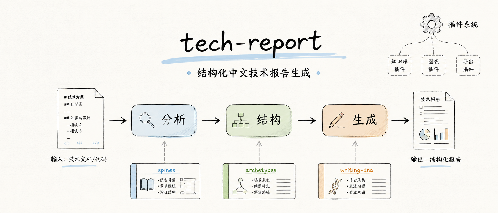
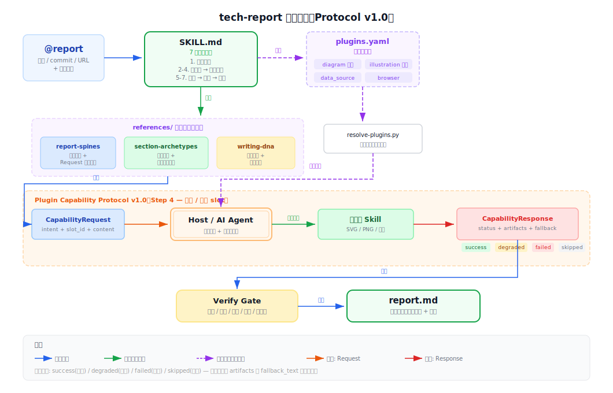

# tech-report

[](LICENSE)
[](https://www.npmjs.com/package/@statefulai/tech-report)

<p align="center">
  
</p>

可插件扩展的 AI Skill：从代码、commit diff、文档链接自动生成结构化中文技术报告，已安装的 skill 自动增强图表与配图。

## 特性

- 📝 **报告排版 + 语言质量** — 不是通用 AI 编排框架，是专注写作质量的 skill（每段首句给结论、代码块精简不堆砌）
- 📚 **多文档架构分析** — 全项目级别分析时自动按功能区拆分为 2-4 篇子文档 + 索引主篇
- 🔌 **插件增强** — 你本地安装的 skill 可以注册为插件，按能力自动补图表、配图或数据
- 📐 **三文件参考系统** — report-spines（骨架 + 长度预算）+ section-archetypes（11 种章节模板）+ writing-dna（风格 + 认知纪律）
- 🎯 **`@report` 触发** — 统一的显式触发前缀
- 🧩 **插件协议** — 已安装的 skill 自动变成报告增强能力，无需手动配置

## 安装

```bash
npx skills add statefulai/tech-report -g
```

## 使用

```
@report 分析下 src/utils/feishuClientAuth.ts
@report 分析 commit fc2d575
@report https://xxx.feishu.cn/docx/xxx
@report 分析 src/auth/ 的架构
@report 分篇分析整个项目的架构
```

## 工作流程

<p align="center">
  
</p>

## 演示

<p align="center">
  
</p>


## 报告类型

tech-report 根据输入内容自动选择报告骨架（spine），每种骨架有预定义的章节顺序：

| 类型 | 触发条件 | 章节结构 |
|------|---------|---------|
| `tech_analysis` | 输入含文件路径 | 概述 → 架构 → 核心逻辑 → 数据流 → 问题与建议 → 总结 |
| `bug_fix` | 含 commit + fix 类型 diff | 问题描述 → 根因分析 → 修复方案 → 影响范围 → 验证 → 总结 |
| `changelog` | 含 commit + 功能/重构 diff | 变更概览 → 变更清单 → 重点详解 → 兼容性 → 总结 |
| `architecture` | 含"架构""设计"关键词 | 系统定位 → 架构总览 → 组件说明 → 数据流 → 设计决策 → 总结 |
| `document_review` | 含 URL | 文档概述 → 结构评估 → 内容准确性 → 完整性 → 改进建议 → 总结 |

## 插件系统

tech-report 专注于报告的结构和文字质量。图表、配图、外部数据等增强能力来自**你本地已安装的其他 AI skill**。

### 你的 skill 生态 = 报告增强管线

装了什么 skill，报告就自动多什么能力：

- 🔌 **装了图表 skill** → 报告自动生成架构图、流程图、对比图
- 🎨 **装了配图 skill** → 报告自动加封面、概念图
- 📊 **装了数据源 skill** → 报告自动拉取飞书/Notion 等外部数据
- 📝 **什么都没装** → 输出高质量纯文字 Markdown 报告

### 注册方式

在 `plugins.yaml` 中注册你想用的 skill：

```yaml
plugins:
  - your-diagram-skill      # 任何能生成 SVG/PNG 图表的 skill
  - your-illustration-skill  # 任何能生成配图的 skill
  - your-data-source-skill   # 任何能读取外部数据（飞书、Notion 等）的 skill
```

无需配置能力映射，tech-report 会自动读取每个 skill 的 `SKILL.md`，推断其能力类型（`diagram` / `illustration` / `data_source` / `browser`）。

**不注册任何插件也能用** — 输出纯文字 Markdown 报告，不包含图表。

### 工作原理

当报告需要架构图时：

1. tech-report 构造请求："画一个三层架构，包含 API Gateway / Auth Service / PostgreSQL"
2. Host（AI agent）选择你安装的图表 skill，适配参数格式
3. 图表 skill 生成 SVG + PNG
4. tech-report 嵌入报告

如果 skill 生成失败，自动降级为文字描述——不会留下空白。

用户无需理解协议细节——只要在 `plugins.yaml` 注册 skill 名即可。

## 支持的宿主

| 宿主 | 安装路径 | 使用方式 |
|------|---------|------|
| Copilot CLI | `~/.agents/skills/` | `@report` |
| Claude Code | `~/.claude/skills/` | `@report` |
| Cursor | `~/.cursor/skills/` | `@report` |
| Codex | `~/.codex/skills/` | `@report` |

## 项目结构

```
tech-report/
├── SKILL.md                    # 核心 skill 指令
├── plugins.yaml                # 插件注册表（用户配置）
├── references/
│   ├── report-spines.md        # 报告骨架定义（5 种）+ 长度预算
│   ├── section-archetypes.md   # 章节 Markdown 模板（11 种，含 doc-index）
│   └── writing-dna.md          # 写作风格 + 认知纪律
├── scripts/
│   └── resolve-plugins.py      # 插件能力解析
├── assets/                     # 封面与示意图
└── package.json
```

## License

MIT
